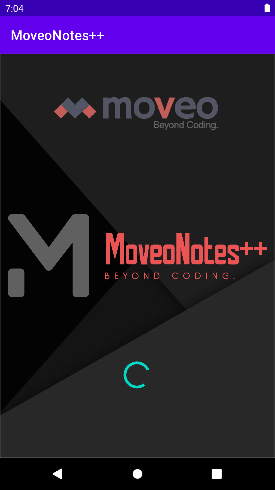
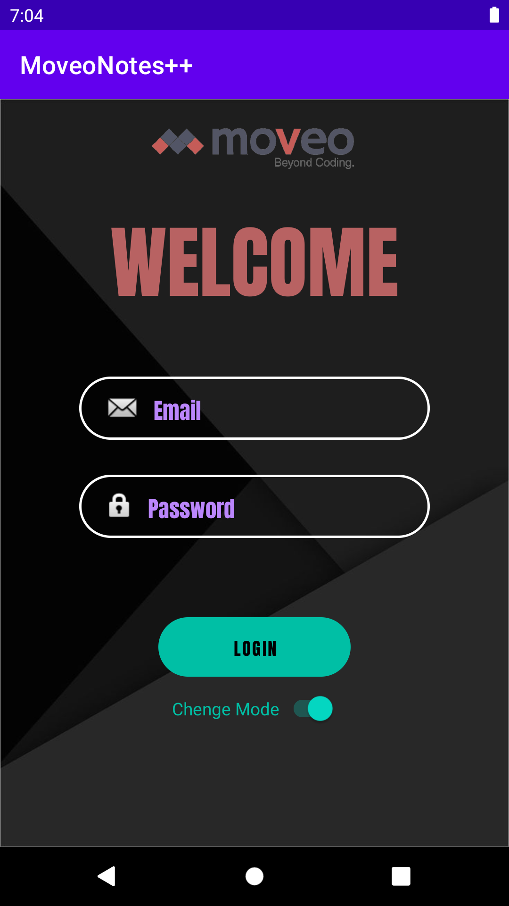

# MoveoNotes++ Android Application 📝

<br />
    <a href="https://github.com/noalecohen1/MoveoNotes">
      <!---  --->
  </a>
 <p>
A Location based Notes Application.
</p>

## App Functionality

1. Implementation of Users Identification and Users Registeration:
	- Authentication and validation inputs of the users when entering the app.
	- Future logins to the app after registeration to the app will auto log in the user.
2. Data is saved in a local DB.
3. Implementation of Note:
	- Each Note can have a title, body, date and location.
4. Implementation of GoogleMaps:
	- For each Note, Map shows a marker at the note location.

## Getting Started...

#### Installation
- Export git repository to Android Studio
```bash
https://github.com/noalecohen1/MoveoNotes.git
```
- Build and run the application on an Android emulator

## Screenshots

Loading Page            | Login Page            |  Register Page
:-------------------------:|:-------------------------:|:-------------------------:
  |   |  

List Mode            |  Map Mode |  Note Screen
:-------------------------:|:-------------------------: |:-------------------------:
  |   |  

	
## Developed by:
* [**Noa Cohen**](https://www.linkedin.com/in/noalecohen1/)
